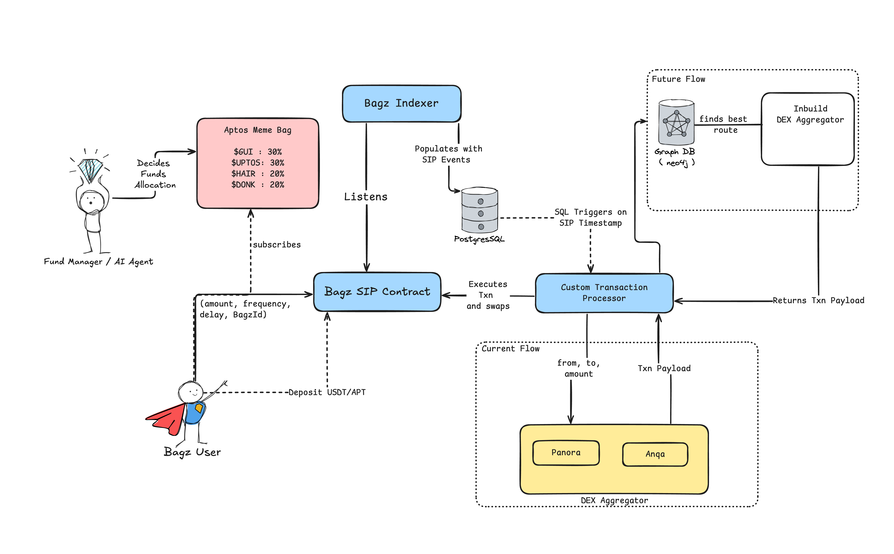
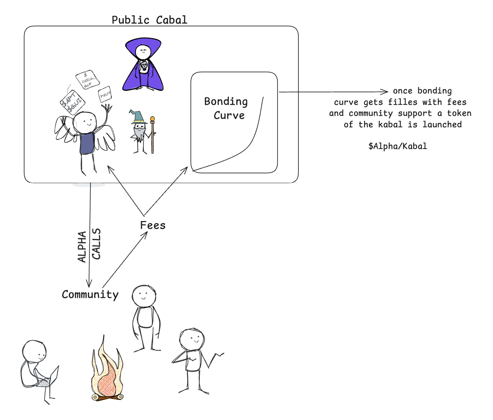
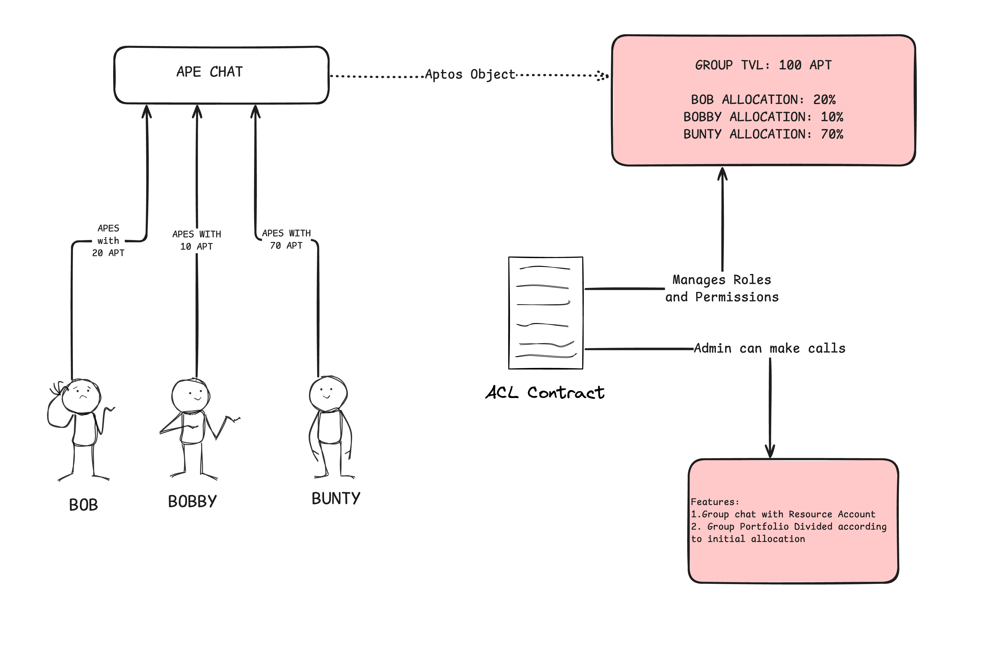
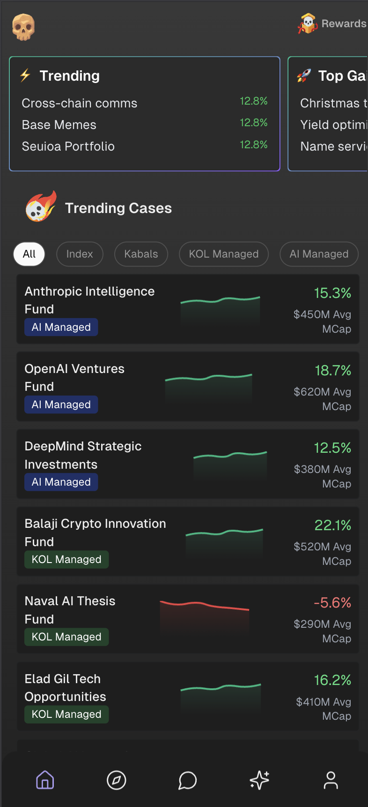
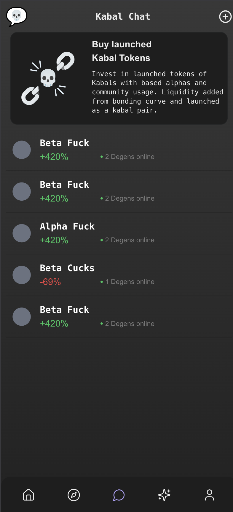
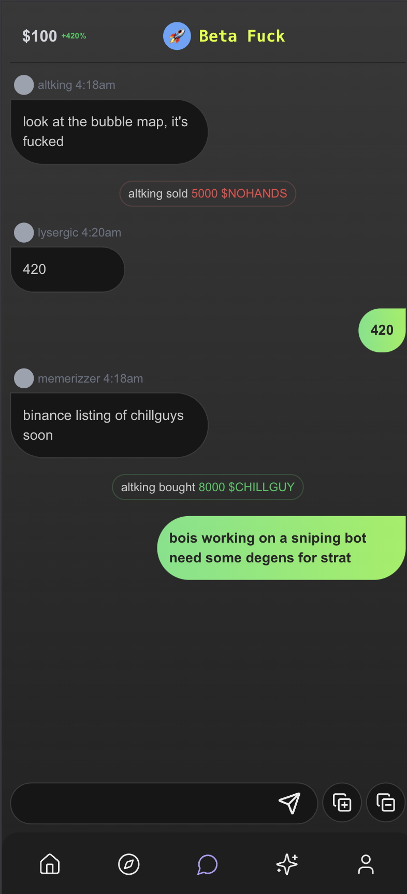
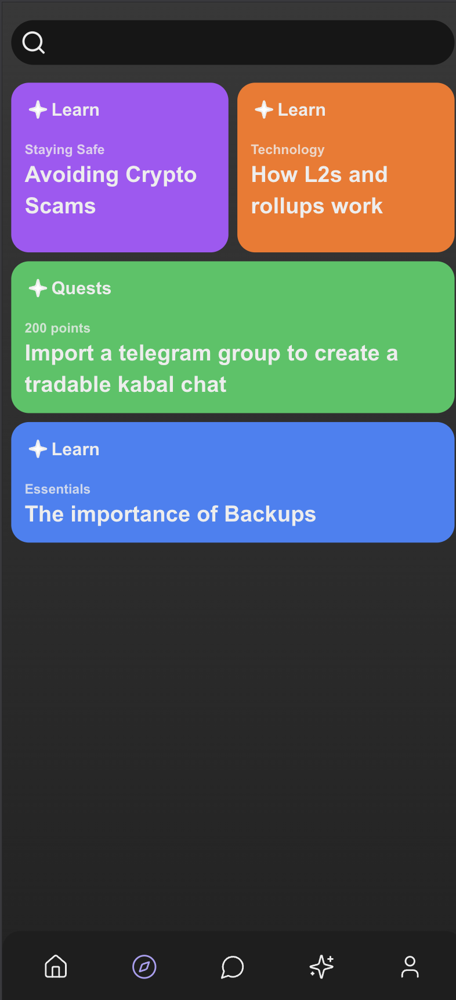

# Kabal.gg
Kabal is a socialfi defi app where users can invest into narratives easily. You can create or invest in basket of funds that can be indexes, managed by KOLs or AI agent. You can create a kabal chat where the group chat can trade together. Kabbal provides a mode of distribution for KOls , Ai agents and cabals to share alphas while earning fees. This fees can be used to fill a bonding curve to launch a token , if the kabal has significant community support and utility.

- Build long-term wealth through , incremental investing into bags that adapt to market trends
- Web2 user friendly crypto investment app
- Degen with frens : Trade together with group custodial wallets
- Tailor-made Bags : Invest automatically into  crypto metas
- Automated SIP : Build long-term wealth through , incremental investing into bags that adapt to market trends

###  Tokenize your kabal from community support
All kabal have an option to be a public fund people can invest in. They trade alpha calls for fees. This fees can be added to a bonding curve and can be used to launch the token of the kabal. Thus a kabal's community support can help launch it's token 

## Kabal AI - Your cabal's degen intern

Kabal AI helps your group chat to execute calls together. Kabal.gg allows you to create kabal's where you can trade together. Kabbal AI built using the **CDK AgentKit** acts as an autonomous agent, that has agentic capability to assist the chat. There is a base contract that enables the group trading and a replit whith the agent. Also Kabal.gg has AI enabled bags where you can invest in AI narratives and startegies. You can extract the latest narratives from twitter and invest in a bag directly.

## Architecture

## App flow

  
   
  
    
      
        
                

